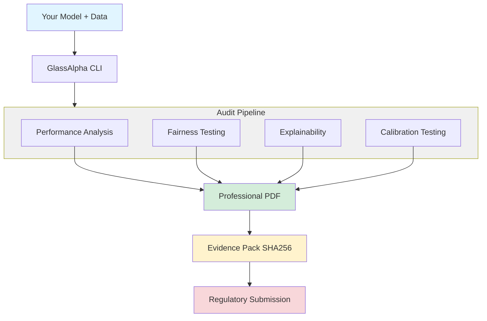

---
hide:
  - navigation
---

# GlassAlpha

GlassAlpha makes **deterministic, regulator-ready PDF audit reports** for tabular ML models. It's an open-source ([Apache 2.0](reference/trust-deployment.md#licensing-dependencies)) toolkit for reproducible, audit-ready model documentation.

_Note: GlassAlpha is currently in beta (v0.2.0). Core functionality is stable with 1000+ passing tests and comprehensive documentation. Breaking API changes may occur before v1.0. First stable release expected Q1 2025._

## How it works

**Single command**: `glassalpha audit --config your_config.yaml --output audit.pdf`

<div class="index-hero-diagram" markdown>



</div>

## Quick links

**New users:**

- [**Quick start guide**](getting-started/quickstart.md): Generate your first audit
- [**Interactive notebook**](https://colab.research.google.com/github/GlassAlpha/glassalpha/blob/main/examples/notebooks/quickstart_colab.ipynb): Try in Colab (zero setup)
- [**Using your own data**](getting-started/custom-data.md): Audit your models with custom CSV files

**Key features:**

- [**Python API reference**](reference/api/audit-entry-points.md): `from_model()` API for notebooks and programmatic use
- [**Feature overview**](getting-started/overview.md): Why choose GlassAlpha and how it compares
- [**Examples**](examples/german-credit-audit.md): Walkthrough ML audits on credit, healthcare, and fraud detection

## Run your first audit in 60 seconds

```bash
# 1. Install with pipx (30 seconds)
pipx install glassalpha

# 2. Generate a quickstart project
glassalpha quickstart

# 3. Run audit (choose your path - both work!)
cd my-audit-project
python run_audit.py          # Option A: Uses generated script (great for learning)
# OR
glassalpha audit             # Option B: Direct CLI (great for CI/CD)

# 4. Done! Open your professional report (~2-3 seconds total)
open reports/audit_report.html  # macOS
# xdg-open reports/audit_report.html  # Linux
# start reports/audit_report.html  # Windows
```

**Or install from source:**

```bash
git clone https://github.com/GlassAlpha/glassalpha
cd glassalpha && pip install -e .
glassalpha audit --config configs/german_credit_simple.yaml --output audit.html --fast
```

**Result**: A professional audit report with model performance, fairness analysis, feature importance, individual explanations, reason codes, preprocessing verification, and complete audit trail.

[See detailed quickstart guide →](getting-started/quickstart.md)

## What you get

Every GlassAlpha audit includes:

- ✅ Model performance metrics (accuracy, precision, recall, F1, AUC)
- ✅ Group fairness with confidence intervals (demographic parity, equal opportunity, predictive parity)
- ✅ Intersectional fairness (bias at demographic intersections like gender×race)
- ✅ Individual fairness (consistency testing, matched pairs, counterfactual analysis)
- ✅ Dataset bias detection (proxy correlations, distribution drift, sampling power)
- ✅ Calibration analysis with confidence intervals (ECE, Brier score, calibration curves)
- ✅ Robustness testing (adversarial perturbations, demographic shift simulation)
- ✅ Feature importance (coefficient-based for linear models, TreeSHAP for gradient boosting)
- ✅ Individual explanations (SHAP values for specific predictions)
- ✅ Preprocessing verification (production artifact validation with dual hash system)
- ✅ Complete audit trail (reproducibility manifest with all seeds, versions, and hashes)

[See complete audit contents →](reference/audit-contents.md)

**Additional commands available:**

- **Reason codes**: Generate ECOA-compliant adverse action notices via `glassalpha reasons`
- **Recourse recommendations**: Generate counterfactual explanations via `glassalpha recourse`

[See CLI reference for all commands →](reference/cli.md)

## Current limitations

GlassAlpha is beta software. Current limitations:

- **Tabular data only** - No text, image, or time series support yet
- **Classification focus** - Limited regression support
- **Cross-platform PDF differences** - Byte-identical PDFs within same platform+Python version, but not across Ubuntu/macOS due to font rendering and library differences. Regulators can reproduce audits on their infrastructure. See [determinism guide](guides/determinism.md) for details
- **Single machine** - No distributed computing support

[See complete limitations and roadmap →](reference/faq.md#are-there-any-limitations-i-should-know-about)

## Why choose GlassAlpha?

GlassAlpha is the only OSS tool that combines professional audit PDFs, easy custom data support, and complete regulatory compliance.

- **Deterministic outputs** - Byte-identical PDFs on same platform+Python+config
- **Complete lineage** - Git SHA, config hash, data hash, seeds recorded
- **Professional formatting** - Publication-quality reports with visualizations
- **No external dependencies** - Runs completely offline
- **Single command** - `glassalpha audit` handles everything

[See detailed comparison and features →](getting-started/overview.md)

## Use cases

- [German credit audit](examples/german-credit-audit.md) - Complete audit walkthrough with German Credit dataset
- [Healthcare bias detection](examples/healthcare-bias-detection.md) - Medical AI compliance example
- [Fraud detection audit](examples/fraud-detection-audit.md) - Financial services compliance example

## Documentation

- [Quick start guide](getting-started/quickstart.md) - Installation and first audit
- [Feature overview](getting-started/overview.md) - Why choose GlassAlpha and how it compares
- [Using custom data](getting-started/custom-data.md) - Audit your own models
- [Configuration guide](getting-started/configuration.md) - YAML configuration reference
- [CLI commands](reference/cli.md) - Complete command reference
- [Trust & deployment](reference/trust-deployment.md) - Architecture, licensing, security, and compliance

## License & trademark

- **License:** Apache 2.0 - See [LICENSE](https://github.com/GlassAlpha/glassalpha/blob/main/LICENSE)
- **Trademark:** While GlassAlpha's code is open source, the brand is not. We respectfully request that our name and logo not be used in confusing or misleading ways. See [TRADEMARK](reference/TRADEMARK.md).

## Support

- **Issues**: [GitHub Issues](https://github.com/GlassAlpha/glassalpha/issues)
- **Discussions**: [GitHub Discussions](https://github.com/GlassAlpha/glassalpha/discussions)

---

_Built for teams who need reproducible, regulator-ready ML audit reports._
